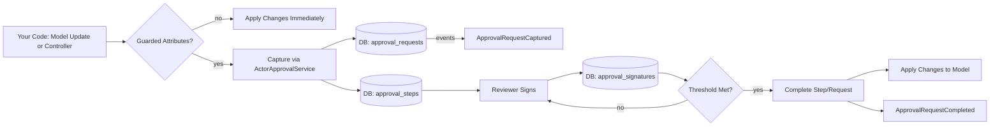

<h1 align="center">Guardrails (ovac/guardrails)</h1>

<p align="center" style="border: 2px dotted #000000">
    <a href="#" target="_blank"></a>
</p>

<p align="center">
  <!-- Installs/Downloads (Packagist) -->
  <a href="https://packagist.org/packages/ovac/guardrails"></a>
  <!-- License -->
  <a href="LICENSE"></a>
  <!-- CI status -->
  <a href="https://github.com/ovac/guardrails/actions/workflows/run-tests.yml"></a>
  <!-- PHP version -->
  
  <!-- Laravel version -->
  
</p>


```md
              Follow me anywhere @ovac4u                         | GitHub
              _________                          _________       | Twitter
             |   ___   |.-----.--.--.---.-.----.|  |  |.--.--.   | Facboook
             |  |  _   ||  _  |  |  |  _  |  __||__    |  |  |   | Instagram
             |  |______||_____|\___/|___._|____|   |__||_____|   | Github + @ovac
             |_________|                        ovac.github.io   | Facebook + @ovacposts
```

<br/>
<br/>

# Guardrails
Guardrails adds human‑in‑the‑loop approvals to your Laravel apps. Mark sensitive attributes, define who must sign, and Guardrails turns risky writes into multi‑signature approval flows — with a tiny API and a minimal review UI.

**Why Guardrails**

- Bold changes need people: routes sensitive writes through multi‑step approvals.
- Zero lock‑in: add a trait to models or intercept in controllers — your choice.
- Fluent flows: any‑of/all‑of permissions and roles, initiator counting, thresholds.
- Batteries included: API, migrations, minimal UI, publishable docs and config.
- Runs where you are: PHP 8.1+, Laravel 10/11, plays nice with Spatie permissions.

**At a Glance**

- Guard models with `ActorGuarded` or call `actorApprovalIntercept()` in controllers.
- Build flows with `FlowExtensionBuilder` (any‑of/all‑of, roles/permissions, steps).
- Approvals are stored as requests → steps → signatures. When the last step passes, the change is applied automatically.

## Quickstart

Install via Composer:

```bash
composer require ovac/guardrails
```

1. Register the service provider (if not auto‑discovered):

```php
// config/app.php
OVAC\Guardrails\GuardrailsServiceProvider::class,
```

2. Publish assets:

```bash
php artisan vendor:publish --provider="OVAC\\Guardrails\\GuardrailsServiceProvider" --tag=guardrails-config
php artisan vendor:publish --provider="OVAC\\Guardrails\\GuardrailsServiceProvider" --tag=guardrails-migrations
php artisan vendor:publish --provider="OVAC\\Guardrails\\GuardrailsServiceProvider" --tag=guardrails-views
php artisan vendor:publish --provider="OVAC\\Guardrails\\GuardrailsServiceProvider" --tag=guardrails-assets
php artisan vendor:publish --provider="OVAC\\Guardrails\\GuardrailsServiceProvider" --tag=guardrails-docs
```

3. Run migrations:

```bash
php artisan migrate
```

## 60‑Second Example

Guard a model and require a quick two‑man rule (initiator + one peer):

```php
use OVAC\Guardrails\Concerns\ActorGuarded;
use OVAC\Guardrails\Services\Flow;

class Post extends Model
{
    use ActorGuarded;

    public function humanGuardAttributes(): array
    {
        return ['published'];
    }

    public function actorApprovalFlow(array $dirty, string $event): array
    {
        return [
            Flow::make()
                ->anyOfPermissions(['content.publish'])
                ->includeInitiator(true, true)
                ->toStep(2, 'Editorial Review')
                ->build(),
        ];
    }
}
```

Prefer controllers? Intercept without touching models:

```php
$result = $this->actorApprovalIntercept($post, ['published' => true], [
    'only' => ['published'],
    'extender' => Flow::make()->anyOfRoles(['editor','managing_editor'])->toStep(1, 'Editorial Approval'),
]);
```

## Why Teams Use It

- Approval confidence for critical data while keeping code changes small.
- Human‑readable flow rules with real‑world patterns (two‑man rule, peer review, escalation).
- Works with your auth today — Spatie permissions if present, token abilities otherwise.

## Use Cases (with examples)

1) Publish a blog post — one more editor must approve

```php
Flow::make()
  ->anyOfPermissions(['content.publish'])    // any editor with publish permission
  ->includeInitiator(true, true)            // author counts as one approval
  ->toStep(2, 'Editorial Review')          // needs one more editor
  ->build();
```

2) Delete a user account — two steps, different roles

```php
Flow::make()
  ->anyOfRoles(['support_lead'])             // support lead approves first
  ->toStep(1, 'Support Approval')
  ->anyOfRoles(['security_officer'])         // then security approves
  ->toStep(1, 'Security Approval')
  ->build();
```

3) Refund an order — one of finance OR operations

```php
Flow::make()
  ->anyOfRoles(['finance_manager','ops_manager'])
  ->toStep(1, 'Management Approval')
  ->build();
```

4) Sensitive setting change — peer with same permission must co‑sign

```php
Flow::make()
  ->permissions(['settings.update'])       // list all required permissions
  ->requireAnyPermissions()                // switch to any‑of
  ->samePermissionAsInitiator(true)        // peer must share at least one
  ->includeInitiator(true, true)           // initiator pre‑approved
  ->toStep(2, 'Peer Review')
  ->build();
```

5) Multi‑step escalation — ops first, then execs

```php
Flow::make()
  ->anyOfPermissions(['ops.change'])
  ->includeInitiator(true, true)
  ->toStep(2, 'Ops Review')
  ->anyOfRoles(['cto','cfo'])
  ->toStep(1, 'Executive Sign‑off')
  ->build();
```

## API (2 endpoints)

- GET `/{route_prefix}` — list pending approval requests with steps/signatures.
- POST `/{route_prefix}/{request}/steps/{step}/approve` — approve a step.

## UI

A minimal page at `/{page_prefix}` consumes the API for reviewers. Publish and customize the Blade view.

## Docs

- Start here: [Documentation Index](resources/docs/README.md)
- Or publish locally: `php artisan vendor:publish --provider="OVAC\\Guardrails\\GuardrailsServiceProvider" --tag=guardrails-docs` (to `docs/guardrails`).

Highlights worth reading next:
- [Organization Playbook](resources/docs/organization-playbook.md)
- [Use Cases](resources/docs/use-cases.md)
- [Advanced Flows (dynamic/risk‑based)](resources/docs/advanced.md)
- [Voting Models](resources/docs/voting-models.md)
- [Auditing & Changelog](resources/docs/auditing-and-changelog.md)
- [Custom Controllers](resources/docs/custom-controllers.md)
- [External Signing (DocuSign/DocuSeal)](resources/docs/external-signing.md)
- [Email & SMS Verification](resources/docs/verification-examples.md)
- [Ideas & Examples (10)](resources/docs/ideas-and-examples.md)
- [Extending Models & Migrations](resources/docs/extending-models-and-migrations.md)
- [Full Testing Guide](resources/docs/testing-full.md)

## How It Works (Data Flow)



Keep approvals close to where changes happen (models) or intercept in controllers. Steps define who can sign and how many signatures you require.

## Extending Migrations and Models

- Add columns to the published migrations (e.g., reason, category, workspace_id) with a new migration; the package models use `$guarded = []`, so new attributes are writable.
- If you need JSON casting or extra relations, create an app model that extends the package model:

```php
// app/Models/ApprovalRequest.php
namespace App\Models;

class ApprovalRequest extends \OVAC\Guardrails\Models\ApprovalRequest
{
    protected $casts = [
        'meta' => 'array',
        'reason' => 'string',
    ];

    public function workspace()
    {
        return $this->belongsTo(Workspace::class);
    }
}
```

Use events like `ApprovalRequestCaptured` to populate new columns or meta. See [Config Recipes](resources/docs/config-recipes.md) and [Auditing & Changelog](resources/docs/auditing-and-changelog.md).

Search keywords: "laravel approval workflow", "laravel multi signature approvals", "human in the loop approvals", "laravel model guarded changes", "laravel approval steps thresholds", "spatie permissions approval flow", "controller intercept approvals", "two-man rule laravel".

## Support

If this package saves you time, please consider:

- Starring the repo: https://github.com/ovac/guardrails
- Sponsoring on GitHub: https://github.com/sponsors/ovac4u
