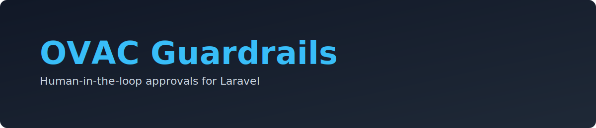

<p align="center" style="border: 2px dotted #000000">
    <a href="https://https://www.openapis.org/" target="_blank"></a>
    <br/>
    <a href="https://https://www.openapis.org/" target="_blank"></a><a href="#" target="_blank"></a><a href="#" target="_blank"></a>
    <br/>
    <a href="https://www.ovac4u.com/idoc" target="_blank"></a>
</p>

<!-- Minimal, high-signal badges only -->
<p align="center">
  <!-- Installs/Downloads (Packagist) -->
  <a href="https://packagist.org/packages/ovac/guardrails"></a>
  <!-- License -->
  <a href="LICENSE"></a>
  <!-- CI status -->
  <a href="https://github.com/ovac/guardrails/actions/workflows/run-tests.yml"></a>
  <!-- PHP version -->
  
  <!-- Laravel version -->
  
  
</p>

<p align="center">
  <a href="#"></a>
</p>

<p align="center">
  <!-- Keeping only 5 essential badges above -->
</p>

```md
              Follow me anywhere @ovac4u                         | GitHub
              _________                          _________       | Twitter
             |   ___   |.-----.--.--.---.-.----.|  |  |.--.--.   | Facboook
             |  |  _   ||  _  |  |  |  _  |  __||__    |  |  |   | Instagram
             |  |______||_____|\___/|___._|____|   |__||_____|   | Github + @ovac
             |_________|                        www.ovac4u.com   | Facebook + @ovacposts
```

<br/>
<br/>

# Guardrails (ovac/guardrails)

Guardrails is a drop‑in, human‑in‑the‑loop approval layer for Laravel management systems. It guards selected model changes and requires multi‑signature approvals with configurable thresholds and steps.

## Install

Install via Composer:

```bash
composer require ovac/guardrails
```

1. Register the service provider (if not auto‑discovered):

```php
// config/app.php
OVAC\Guardrails\GuardrailsServiceProvider::class,
```

2. Publish assets:

```bash
php artisan vendor:publish --provider="OVAC\\Guardrails\\GuardrailsServiceProvider" --tag=guardrails-config
php artisan vendor:publish --provider="OVAC\\Guardrails\\GuardrailsServiceProvider" --tag=guardrails-migrations
php artisan vendor:publish --provider="OVAC\\Guardrails\\GuardrailsServiceProvider" --tag=guardrails-views
php artisan vendor:publish --provider="OVAC\\Guardrails\\GuardrailsServiceProvider" --tag=guardrails-assets
php artisan vendor:publish --provider="OVAC\\Guardrails\\GuardrailsServiceProvider" --tag=guardrails-docs
```

3. Run migrations:

```bash
php artisan migrate
```

## Configure

`config/guardrails.php`:

- `route_prefix` (string): API prefix, default `staff/v1/guardrails`.
- `page_prefix` (string): Web page prefix, default `staff/guardrails`.
- `middleware` (array): API middleware stack.
- `web_middleware` (array): Web route middleware stack.
- `views.layout` (string|null): Parent layout for views.
- `views.section` (string): Section name for content.
- `permissions.view` (string): Ability required to list approvals.
- `permissions.sign` (string): Ability required to sign/approve steps.

## Usage

Add the `HumanGuarded` trait to any model and declare rules:

```php
use OVAC\Guardrails\Concerns\HumanGuarded;

class EcurrencySetting extends Model {
    use HumanGuarded;

    public function humanGuardAttributes(): array {
        return ['buy_normal_rate','sell_normal_rate','visible'];
    }

    public function humanApprovalFlow(array $dirty, string $event): array {
        return [
            // Example: Require two approvals from staff with the same permission as the initiator, counting
            // the initiator as one approval automatically (so only one more approval is needed).
            \OVAC\Guardrails\Services\FlowExtensionBuilder::make()
                ->permissions(['local_rates.manage'])
                ->requireAnyPermissions() // allow any one of listed perms
                ->samePermissionAsInitiator(true) // require overlap with initiator's perm
                ->includeInitiator(true, true) // include + preapprove initiator
                ->toStep(2, 'Ops Review')
                ->build(),

            // Example: One of any two roles
            [
                'name' => 'Management',
                'threshold' => 1,
                'signers' => [
                    'roles' => ['finance_manager','ops_manager'],
                    'roles_mode' => 'any',
                ],
            ],
        ];
    }
}
```

Or intercept inside controllers without modifying models:

```php
use OVAC\Guardrails\Services\ControllerInterceptor;
use OVAC\Guardrails\Services\FlowExtensionBuilder as Flow;

$result = $this->humanApprovalIntercept($model, $changes, [
    'only' => ['status_id'],
    'extender' => Flow::make()
        ->permissionsAny(['orders.manage','orders.escalate']) // any-of
        ->includeInitiator(true, true)
        ->toStep(2, 'Ops')
]);
```

## API

- `GET /{route_prefix}` — list pending approval requests with steps/signatures.
- `POST /{route_prefix}/{request}/steps/{step}/approve` — approve a step.

## UI

Guardrails ships with a minimal page at `/{page_prefix}` that consumes the API. Publish and customize the blade view as needed.

## Docs

See `resources/docs` for idoc‑style documentation. When published, the files are copied into `docs/guardrails`.

Search keywords: "laravel approval workflow", "laravel multi signature approvals", "human in the loop approvals", "laravel model guarded changes", "laravel approval steps thresholds", "spatie permissions approval flow", "controller intercept approvals", "two-man rule laravel".

## Support

If this package saves you time, please consider:

- Starring the repo: https://github.com/ovac/guardrails
- Sponsoring on GitHub: https://github.com/sponsors/ovac4u
