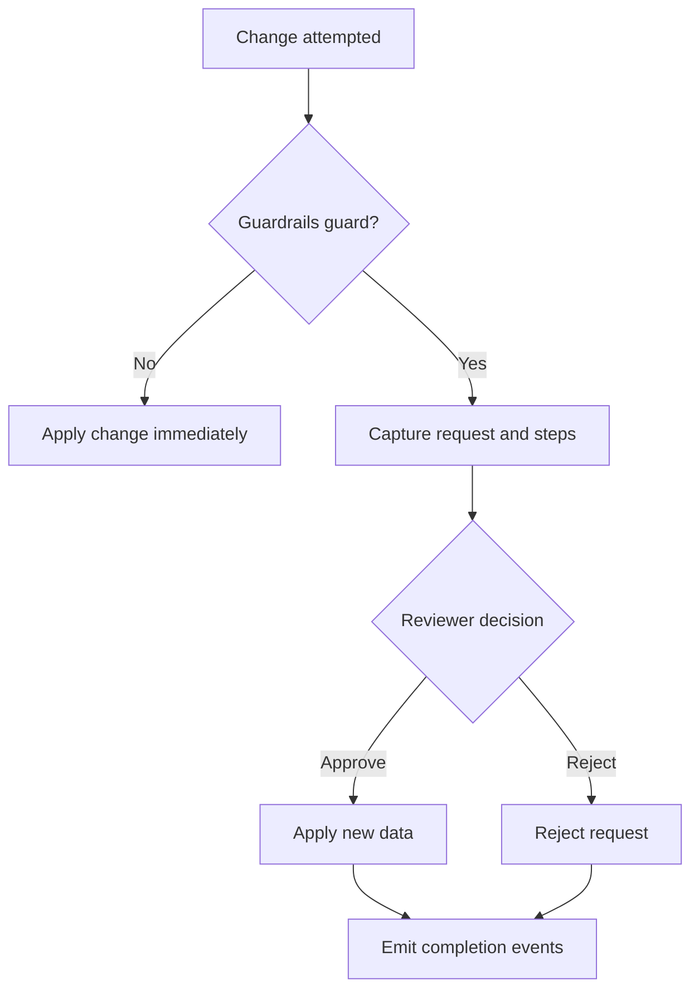

<h1 align="center">Guardrails</h1>

```md
              Follow me anywhere @ovac4u                         | GitHub
              _________                          _________       | Twitter
             |   ___   |.-----.--.--.---.-.----.|  |  |.--.--.   | Facebook
             |  |  _   ||  _  |  |  |  _  |  __||__    |  |  |   | Instagram
             |  |______||_____|\___/|___._|____|   |__||_____|   | Github + @ovac
             |_________|                        ovac.github.io   | Facebook + @ovacposts
```

<p align="center" style="border: 2px dotted #000000">
    <a href="#" target="_blank"></a>
</p>

<p align="center">
  <!-- Installs/Downloads (Packagist) -->
  <a href="https://packagist.org/packages/ovac/guardrails"></a>
  <!-- License -->
  <a href="LICENSE"></a>
  <!-- CI status -->
  <a href="https://github.com/ovac/guardrails/actions/workflows/run-tests.yml"></a>
  <!-- PHP version -->
  
  <!-- Laravel version -->
  
</p>


## What is Guardrails?

Guardrails is an operational approvals engine for Laravel. Capture every high‑risk change, route it through the right reviewers, and apply the update only after the required signatures land. You decide which attributes are guarded, who can approve, and how many voices it takes to ship a change.

### Why teams reach for Guardrails

- **Protect critical workflows** – turn dangerous writes into reviewable approval requests without rewriting business logic.
- **Model or controller first** – opt in with an Eloquent trait or intercept at the edge of your HTTP layer.
- **Fluent, composable flows** – stack steps, mix roles and permissions, count initiators, and codify escalation in code.
- **Complete toolkit** – ships with migrations, API routes, reviewer UI, and exhaustive docs so you can go live quickly.
- **Laravel-native** – PHP 8.1+, Laravel 10/11, works with Spatie permissions or Sanctum token abilities out of the box.

### How it fits together

1. Mark attributes as guarded or intercept controller payloads.
2. Use `Flow::make()` / `FlowBuilder` to describe who can sign each step.
3. Guardrails persists the request (`requests → steps → signatures`) and emits events as people approve or reject.
4. Once the final step meets its threshold, Guardrails applies the captured changes to your model for you.

## Quickstart

## Online Docs & Tools

- Full documentation: https://ovac.github.io/guardrails/
- Interactive Playground (flow builder): https://ovac.github.io/guardrails/playground
- AI Assistant (BYO API key, grounded in docs): https://ovac.github.io/guardrails/assistant


Install via Composer:

```bash
composer require ovac/guardrails
```

1. Register the service provider (if not auto‑discovered):

```php
// config/app.php
OVAC\Guardrails\GuardrailsServiceProvider::class,
```

2. Publish assets:

```bash
php artisan vendor:publish --provider="OVAC\\Guardrails\\GuardrailsServiceProvider" --tag=guardrails-config
php artisan vendor:publish --provider="OVAC\\Guardrails\\GuardrailsServiceProvider" --tag=guardrails-migrations
php artisan vendor:publish --provider="OVAC\\Guardrails\\GuardrailsServiceProvider" --tag=guardrails-views
php artisan vendor:publish --provider="OVAC\\Guardrails\\GuardrailsServiceProvider" --tag=guardrails-assets
php artisan vendor:publish --provider="OVAC\\Guardrails\\GuardrailsServiceProvider" --tag=guardrails-docs
```

3. Run migrations:

```bash
php artisan migrate
```

## 60‑Second Example

Guard a model and require a quick two‑man rule (initiator + one peer):

```php
use OVAC\Guardrails\Concerns\Guardrail;
use OVAC\Guardrails\Services\Flow;

class Post extends Model
{
    use Guardrail;

    public function guardrailAttributes(): array
    {
        return ['published'];
    }

    public function guardrailApprovalDescription(array $dirty, string $event): string
    {
        return 'Publish flag changes require editorial approval.';
    }

    public function guardrailApprovalFlow(array $dirty, string $event): array
    {
        return [
            Flow::make()
                ->anyOfPermissions(['content.publish'])
                ->includeInitiator(true, true)
                ->signedBy(2, 'Editorial Review')
                ->build(),
        ];
    }
}
```

When the initiator supplies a justification (for example through a form field), pass it into the guardrails context before saving:

```php
$post->guardrails()
    ->description($request->input('approval_description'))
    ->meta(['reason_code' => $request->input('reason_code')]);

$post->fill($request->validated())->save();
```

Prefer controllers? Intercept without touching models:

```php
$result = $this->guardrailIntercept($post, ['published' => true], [
    'description' => 'Editorial approval required before publishing.',
    'only' => ['published'],
    'extender' => Flow::make()->anyOfRoles(['editor','managing_editor'])->signedBy(1, 'Editorial Approval'),
]);
```

### Configurable controller flows (no code changes)

Keep controllers tiny and let ops override steps from `config/guardrails.php`. The helper will (a) look for `guardrails.flows.<feature>.<action>`, (b) fall back to your coded flow when missing, and (c) merge handy meta defaults (like `summary`/`hint`) onto every step.

```php
// config/guardrails.php
'flows' => [
    'posts' => [
        'publish' => [
            [
                'name' => 'Editorial Approval',
                'threshold' => 1,
                'signers' => [
                    'guard' => 'web',
                    'permissions' => ['content.publish'],
                    'permissions_mode' => 'any',
                    'roles' => [],
                    'roles_mode' => 'all',
                ],
                'meta' => [
                    'include_initiator' => false,
                    'preapprove_initiator' => true,
                    'hint' => 'Editor must sign off before publishing.',
                ],
            ],
        ],
    ],
],
// or flatten the key if you prefer:
// 'flows' => ['posts.publish' => [[ /* steps */ ]]],
// single-step shorthand is also valid (no extra brackets):
// 'flows' => [
//     'posts.publish' => [
//         'name' => 'Editorial Approval',
//         'threshold' => 1,
//         'signers' => ['guard' => 'web', 'permissions' => ['content.publish']],
//     ],
// ],
```

```php
// Controller
use OVAC\Guardrails\Services\Flow;

// Resolve "posts.publish" flow: config first, fallback to code, merge meta defaults.
$flow = $this->guardrailFlow(
    'posts.publish',
    Flow::make()->anyOfPermissions(['content.publish'])->includeInitiator(true, true)->signedBy(2, 'Editorial Approval')->build(),
    ['summary' => 'Publish request for '.$post->title]
);

$result = $this->guardrailIntercept($post, ['published' => true], [
    'description' => 'Editorial approval required before publishing.',
    'flow' => $flow,
]);
```

## Why Teams Use It

- Approval confidence for critical data while keeping code changes small.
- Human-readable flow rules with real-world patterns (two-man rule, peer review, escalation).
- Works with your auth today — Spatie permissions if present, token abilities otherwise.

## Use Cases (with examples)

1) Publish a blog post — one more editor must approve

```php
Flow::make()
  ->anyOfPermissions(['content.publish'])    // any editor with publish permission
  ->includeInitiator(true, true)            // author counts as one approval
  ->signedBy(2, 'Editorial Review')          // needs one more editor
  ->build();
```

2) Delete a user account — two steps, different roles

```php
Flow::make()
  ->anyOfRoles(['support_lead'])             // support lead approves first
  ->signedBy(1, 'Support Approval')
  ->anyOfRoles(['security_officer'])         // then security approves
  ->signedBy(1, 'Security Approval')
  ->build();
```

3) Refund an order — one of finance OR operations

```php
Flow::make()
  ->anyOfRoles(['finance_manager','ops_manager'])
  ->signedBy(1, 'Management Approval')
  ->build();
```

4) Sensitive setting change — peer with same permission must co‑sign

```php
Flow::make()
  ->permissions(['settings.update'])       // list all required permissions
  ->requireAnyPermissions()                // switch to any‑of
  ->samePermissionAsInitiator(true)        // peer must share at least one
  ->includeInitiator(true, true)           // initiator pre‑approved
  ->signedBy(2, 'Peer Review')
  ->build();
```

5) Multi‑step escalation — ops first, then execs

```php
Flow::make()
  ->anyOfPermissions(['ops.change'])
  ->includeInitiator(true, true)
  ->signedBy(2, 'Ops Review')
  ->anyOfRoles(['cto','cfo'])
  ->signedBy(1, 'Executive Sign‑off')
  ->build();
```

## API (3 endpoints)

- GET `/{route_prefix}` — list pending approval requests with steps/signatures.
- POST `/{route_prefix}/{request}/steps/{step}/approve` — approve a step.
- POST `/{route_prefix}/{request}/steps/{step}/reject` — record a rejection signature.

## UI

A minimal page at `/{page_prefix}` consumes the API for reviewers. Publish and customize the Blade view.

## Docs

- Start here: [Documentation Index](resources/docs/README.md)
- Or publish locally: `php artisan vendor:publish --provider="OVAC\\Guardrails\\GuardrailsServiceProvider" --tag=guardrails-docs` (to `docs/guardrails`).

Highlights worth reading next:
- [Organization Playbook](resources/docs/organization-playbook.md)
- [Use Cases](resources/docs/use-cases.md)
- [Advanced Flows (dynamic/risk‑based)](resources/docs/advanced.md)
- [Voting Models](resources/docs/voting-models.md)
- [Auditing & Changelog](resources/docs/auditing-and-changelog.md)
- [Custom Controllers](resources/docs/custom-controllers.md)
- [External Signing (DocuSign/DocuSeal)](resources/docs/external-signing.md)
- [Email & SMS Verification](resources/docs/verification-examples.md)
- [Ideas & Examples (10)](resources/docs/ideas-and-examples.md)
- [Extending Models & Migrations](resources/docs/extending-models-and-migrations.md)
- [Full Testing Guide](resources/docs/testing-full.md)

## How It Works (Data Flow)



Keep approvals close to where changes happen (models) or intercept in controllers. Steps define who can sign and how many signatures you require.

## Extending Migrations and Models

- Add columns to the published migrations (e.g., reason, category, workspace_id) with a new migration; the package models use `$guarded = []`, so new attributes are writable.
- If you need JSON casting or extra relations, create an app model that extends the package model:

```php
// app/Models/ApprovalRequest.php
namespace App\Models;

class ApprovalRequest extends \OVAC\Guardrails\Models\ApprovalRequest
{
    protected $casts = [
        'meta' => 'array',
        'reason' => 'string',
    ];

    public function workspace()
    {
        return $this->belongsTo(Workspace::class);
    }
}
```

Use events like `ApprovalRequestCaptured` to populate new columns or meta. See [Config Recipes](resources/docs/config-recipes.md) and [Auditing & Changelog](resources/docs/auditing-and-changelog.md).

Search keywords: "laravel approval workflow", "laravel multi signature approvals", "human in the loop approvals", "laravel model guarded changes", "laravel approval steps thresholds", "spatie permissions approval flow", "controller intercept approvals", "two-man rule laravel".

## Documentation Website

Guardrails ships build scripts instead of doc sources so the Composer install stays slim. The GitHub Pages deployment uses `scripts/docs-site/build-docs-site.js` to assemble a Docusaurus bundle from `resources/docs` on demand.

- Generate a local bundle with `node scripts/docs-site/build-docs-site.js ./build/docs-site` (requires Node 20+). When previewing locally, open `http://localhost:3000/guardrails/` after running `npx serve ./build/docs-site`. For a root-based preview, run `DOCS_BASE_URL=/ node scripts/docs-site/build-docs-site.js ./build/docs-site-local && npx serve ./build/docs-site-local`.
- Configure optional environment variables (`DOCS_SITE_URL`, `DOCS_BASE_URL`, `DOCS_REPOSITORY_URL`, `DOCS_PACKAGIST_URL`) to tune canonical URLs and metadata. Defaults infer the correct GitHub Pages paths from the current repository.
- The published site exposes `/playground` and `/assistant` routes for the interactive flow builder and BYO-key AI chat, both running entirely in the browser.
- Tags that start with `v` automatically generate frozen documentation snapshots so visitors can browse historical releases.
- `.github/workflows/docs-site.yml` runs on every push and tag, rebuilding the static site and deploying it to GitHub Pages (`gh-pages` branch).

## Tests & Coverage

Run the full suite with Pest (quiet mode by default):

```bash
composer test
```

Generate coverage locally when you need instrumentation or Clover output for CI:

```bash
composer test:coverage
composer test:ci # emits coverage.xml
```

See the [Full Testing Guide](resources/docs/testing-full.md) for environment setup, Laravel Testbench tips, and additional testing recipes.


## Support

If this package saves you time, please consider:

- Starring the repo: https://github.com/ovac/guardrails
- Sponsoring on GitHub: https://github.com/sponsors/ovac4u
