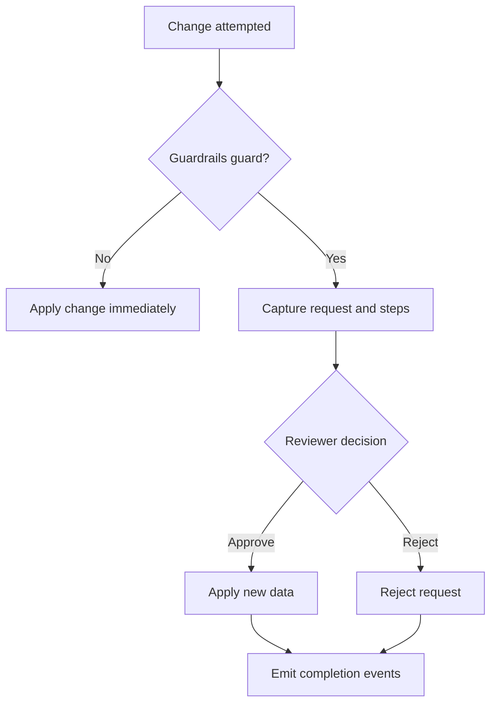

title: Documentation Index
description: Complete Guardrails documentation with guides and references.

# Guardrails Documentation

Welcome to the Guardrails manual. Inside you’ll find everything you need to wire guarded attributes, design approval flows, expose the reviewer experience, and plug Guardrails into the rest of your Laravel stack – complete with practical copy‑paste examples.

Sections

- [Getting Started](./getting-started.md)
- [Concepts & Overview](./overview.md)
- [Configuration Reference](./configuration.md)
- [Model Guarding Guide](./usage-models.md)
- [Controller Interception Guide](./usage-controllers.md)
- [Flow Builder Reference](./flow-builder.md)
- [Signing Policy Reference](./signing-policy.md)
- [Common Patterns](./patterns.md)
- [Use Cases](./use-cases.md)
- [Organization Playbook](./organization-playbook.md)
- [Advanced Flows](./advanced.md)
- [Voting Models](./voting-models.md)
- [Bots & Automation](./bots-and-automation.md)
- [Auditing & Changelog](./auditing-and-changelog.md)
- [Config Recipes](./config-recipes.md)
- [Custom Controllers](./custom-controllers.md)
- [External Document Signing](./external-signing.md)
- [Email & SMS Verification](./verification-examples.md)
- [Ideas & Examples](./ideas-and-examples.md)
- [Extending Models & Migrations](./extending-models-and-migrations.md)

## How It Works

- [Database & Migrations](./database.md)
- [API Reference](./api.md)
- [UI & Assets](./ui.md)
- [Permissions & Policies](./permissions.md)
- [Testing & Local Dev](./testing.md)
- [FAQ](./faq.md)

Key signals you can listen to:

- `ApprovalRequestCaptured` when a request is created.
- `ApprovalStepApproved` for every approval signature that gets recorded.
- `ApprovalRequestCompleted` once the approval threshold is met and changes are applied.
- `ApprovalStepRejected` for every rejection signature that gets recorded (check `step->status` for pending vs rejected).
- `ApprovalRequestRejected` once the rejection threshold is met and the request is halted.
